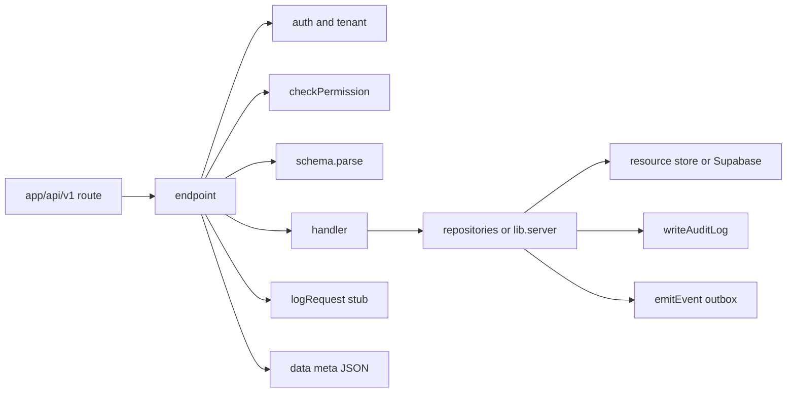

# API Control Plane

Implementation roadmap for a shared `endpoint()` API layer in Splx Studio.
Written so this work can be picked up later without re-deriving context from chat.

**Status:** Planned — not implemented yet.  
**Canonical repo:** `~/Developer/web/splx` (not `~/Developer/nextjs/splx`, which is an empty placeholder).

Related docs: [RBAC_SYSTEM.md](./RBAC_SYSTEM.md), [DATABASE_ARCHITECTURE.md](./DATABASE_ARCHITECTURE.md), [PAGES_SYSTEM.md](./PAGES_SYSTEM.md), [AI_CHAT_SYSTEM.md](./AI_CHAT_SYSTEM.md).

---

## Why this exists

### Product vision (context)

Splx is intended to grow from “data + page builder + AI chat” into an **organizational operating system**:

- Core data (tables) and system definitions (pages, automations, email templates) are first-class editable objects.
- Business processes are Zapier-style automations: typed events → durable step config → deterministic runner.
- UI builder and AI agent use the **same** mutation APIs.
- Definition changes eventually support draft → review → publish (separate from live instance data).

Agent C (`~/Developer/web/agent`, Eve-based) is a strong **agent runtime** (durable sessions, channels, skills, sandbox). Splx is the stronger **kernel** (workspaces, RBAC, tables, pages). Long-term shape: Splx as system of record; Eve-grade agent as a client of Splx APIs — not a merge of the two products. This doc does **not** implement Eve; it builds the control plane both UI and future agent tools need.

### Immediate problem

Today’s API layer cannot safely support that vision:


| Concern          | Today                                                                                                                                   |
| ---------------- | --------------------------------------------------------------------------------------------------------------------------------------- |
| Auth session     | Mostly centralized in `proxy.ts` (Supabase cookies, workspace hint)                                                                     |
| Authorization    | Fragmented — some routes use `resolveTenantContext` + `requireCapability`; workspace admin / chat / helpers use other patterns          |
| Shared wrapper   | **None** — no `withAuth` / `endpoint`; copy-paste `handleError`                                                                         |
| Row mutations    | `/api/data/[tableName]` — raw SQL on resource store, thin validation, **bypasses RLS**                                                  |
| Post-write hooks | **None** — no domain events, no audit trail                                                                                             |
| Request logging  | Ad-hoc `console.*` + generic OTel (`instrumentation.ts` service name `"ai-chatbot"`)                                                    |
| Docs vs code     | `RBAC_SYSTEM.md` describes DB `role_permissions` as SoR; API handlers mostly use a **static** map in `lib/server/tenant/permissions.ts` |


Without a single mutation funnel (auth → permission → validate → write → audit → emit), automations and “agent = same API as UI” cannot be added cleanly.

---


## Target architecture

```text
HTTP → app/api/v1/.../route.ts
     → endpoint({ auth, permission, schema?, handler })
          auth → tenant/roles → checkPermission → Zod body
     → handler({ user, workspace, params, body, requestId, req })
          → repo.* / lib/server/* helpers / getResourceStore()
          → writeAuditLog + emitEvent (on mutations)
     → { data, meta? } → Response.json
     → logRequest stub (requestId, method, path, user, status, duration)
```




### Mental model

Treat routes as **thin adapters**: declare auth + permission + schema; keep handlers focused on orchestration. Prefer repos / `lib/server` for shared mutations. Emit technical events from the base data repo; emit domain events (`order.cancelled`, …) from handlers/lib when the product meaning is known. Always scope by `workspace_id` (or tenant resource store) outside the base repo.

---


## Decisions (locked)


| Decision           | Choice                                                                                                                                                |
| ------------------ | ----------------------------------------------------------------------------------------------------------------------------------------------------- |
| Wrapper            | `endpoint({ auth, permission, schema?, handler })` — same shape as the CodeBase-style internal API pattern                                            |
| Do not port        | Creator-staff / mentorship role loaders and other domain-specific wrapper branches from that other project                                            |
| Layout             | New `server/` tree for control plane; call into existing `lib/server/**` initially (no big-bang move of pages/tables)                                 |
| Permissions        | Declarative `resource:action:scope` strings; map admin / builder / user / viewer onto them; evolve away from ad-hoc `"pages.edit"` strings            |
| Response shape     | `{ data, meta? }`; shared `unauthorized` / `forbidden` / `handleError`; map `Unauthorized` → **401** (today many routes map it to 500)                |
| Repos              | Hybrid: domain repos for pages / tables / reports; `createDataRepository` (or equivalent) for dynamic row CRUD with audit + technical events built in |
| Events             | `emitEvent()` → `event_outbox`; failures **log, do not throw**                                                                                        |
| Event kinds        | System: `db.<table>.created | updated | deleted`; Product: named later (`signup.accepted`, …)                                                         |
| Audit              | `writeAuditLog()` → `audit_logs` on mutations                                                                                                         |
| Request logging    | Stub `console.log` with structured fields + `requestId` until a real sink exists                                                                      |
| Streaming          | Chat / SSE **out of** success-JSON `endpoint`; auth+permission only or a later `streamEndpoint`                                                       |
| Versioning         | New routes under `/api/v1/`; migrate callers; old routes re-export or deprecate                                                                       |
| Resource SQL / RLS | Document honestly: `/api/data` still uses privileged resource-store SQL; controls are capability + validation + audit until a tighter model exists    |


---


## Proposed file tree

```text
server/
  api/
    endpoint.ts          # wrapper
    auth.ts              # getUser + resolveTenantContext adapter
    responses.ts         # unauthorized, forbidden, handleError, success shape
    types.ts             # User / EndpointContext
  permissions/
    definitions.ts       # Permission union + role → permission map
    check.ts             # checkPermission({ user, permission, resourceId? })
  repositories/
    index.ts             # unified `repo` export
    data.ts              # dynamic table row CRUD + audit + db.* events
    pages.ts             # thin wrap of lib/server/pages (optional early)
    tables.ts
    reports.ts
  lib/
    events.ts            # emitEvent → event_outbox
    audit.ts             # writeAuditLog → audit_logs
    event-descriptions.ts  # human-readable labels (optional early)

supabase/migrations/
  YYYYMMDDHHMMSS_event_outbox_and_audit_logs.sql

app/api/v1/
  data/[tableName]/route.ts    # first migration target
  pages/...
  tables/...
  reports/...
  workspace/...
```

**Keep using (do not delete):**

- `lib/server/tenant/context.ts` — tenant resolution
- `lib/server/tenant/resource-store.ts` — local vs hosted DB
- `lib/server/pages`, `lib/server/tables`, `lib/server/reports`, `lib/server/data`
- `proxy.ts` — session cookie refresh + workspace header (middleware stays; wrapper re-checks)

**Replace over time:**

- Direct `requireCapability` / static `"pages.edit"` strings in route handlers → declarative permissions on `endpoint`
- Per-route `handleError` copies → `server/api/responses.ts`

---


## Permissions sketch

Start by mapping today’s static capabilities (`[lib/server/tenant/permissions.ts](../lib/server/tenant/permissions.ts)`) into declarative form. Fix known bugs while doing so:


| Bug today                                          | Fix                                        |
| -------------------------------------------------- | ------------------------------------------ |
| Routes require `data.read` but map has `data.view` | Use one name (`data:view:workspace`)       |
| `workspace.manage` used but not in map             | Add `workspace:manage:workspace` (admin)   |
| Workspace users/roles/invites lack RBAC            | Require manage permissions on those routes |


Example role mapping (initial):


| Role    | Permissions (illustrative)                                   |
| ------- | ------------------------------------------------------------ |
| admin   | `*`                                                          |
| builder | pages/tables/reports edit+view; data view/create/edit/delete |
| user    | pages/tables view; data view/create/edit/delete              |
| viewer  | pages/tables/data view only                                  |


Expand later: `automations:edit:workspace`, `automations:publish:workspace`, `templates:edit:workspace`.

**Note:** DB `role_permissions` / RLS (see [RBAC_SYSTEM.md](./RBAC_SYSTEM.md)) remain relevant for Supabase-client paths (page/table **metadata**). The control plane is the SoR for **API handler** authorization. Plan a later reconciliation so DB permissions and `definitions.ts` do not permanently diverge.

---


## Example route (target)

```ts
// app/api/v1/data/[tableName]/route.ts
import { endpoint } from "@/server/api/endpoint";
import { repo } from "@/server/repositories";
import { z } from "zod";

const patchSchema = z.object({
  // Prefer validating against table field_metadata inside the repo
}).passthrough();

export const PATCH = endpoint({
  auth: "required",
  permission: "data:update:workspace",
  schema: patchSchema,
  async handler({ params, body, user, requestId }) {
    const row = await repo.data(params.tableName).update({
      workspaceId: user.workspaceId!,
      id: params.id, // or from query — match current ?id= contract
      patch: body,
      actorUserId: user.userId,
      requestId,
    });
    // repo.update: SQL → writeAuditLog → emitEvent('db.<table>.updated')
    return { data: row };
  },
});
```

Handlers stay orchestration-only. Audit and technical events live in the repo for well-known mutate paths.

---


## Current capability inventory (baseline)

Use this when migrating; do not assume README claims over code.


| Area                            | Status  | Notes                                                         |
| ------------------------------- | ------- | ------------------------------------------------------------- |
| Workspaces / RBAC roles         | Exists  | admin/builder/user/viewer; nav polish incomplete              |
| Dynamic tables + `/api/data`    | Exists  | Mutate path is the priority for v1                            |
| Pages / blocks                  | Exists  | Trigger **execute** is a stub (`useTriggerBlockAction` no-op) |
| Reports                         | Exists  |                                                               |
| Documents / chat artifacts      | Exists  | Chat side-products, not system definitions                    |
| AI tools write path             | Partial | Documents only; no page/table/automation mutations            |
| Events / webhooks / automations | Missing | Workflows nav “Coming soon”                                   |
| Email templates as entities     | Missing | Only product release emails                                   |
| Draft → publish for definitions | Missing | Page “draft” = in-memory; autosave writes live                |
| Central audit / request log     | Missing |                                                               |


---


## Implementation phases


### Phase 0 — Doc + agreement (this document)

No code. Align on decisions above.

### Phase 1 — Foundation

1. Add `server/api/{endpoint,auth,responses,types}.ts`.
2. Add `server/permissions/{definitions,check}.ts` mirroring current roles; fix `data.view` / `workspace.manage`.
3. Adapter: Supabase user + `resolveTenantContext` → `EndpointContext.user` (include `workspaceId`, roles).
4. Unit-test `checkPermission` and error mapping (401/403/400/500).

**Exit:** One throwaway or health route on `/api/v1/` proves the wrapper.

### Phase 2 — Audit + event outbox tables

1. Migration: `audit_logs`, `event_outbox` (workspace-scoped; indexes on `workspace_id`, `created_at`, `event_name` / processed flag).
2. `writeAuditLog`, `emitEvent` (insert outbox; catch/log failures).
3. Optional `event-descriptions.ts` for human labels.

**Exit:** Can insert audit + outbox rows from a script or test.

### Phase 3 — Data API v1 (highest leverage)

1. Implement `server/repositories/data.ts`:
  - Load table config for workspace
  - Validate body keys against field metadata
  - INSERT/UPDATE/DELETE via resource store
  - `writeAuditLog` + `emitEvent('db.<physicalTable>.created|updated|deleted')`
2. Add `app/api/v1/data/[tableName]/route.ts` via `endpoint`.
3. Point UI fetchers at v1 **or** make legacy `/api/data/[tableName]` a thin re-export to v1.
4. Fix path-param ambiguity if `config.id !== physical table name` (document contract: prefer stable id in path, resolve name from config).

**Exit:** All row CRUD goes through control plane with audit + technical events.

### Phase 4 — Pages / tables / reports mutations

1. Wrap save/create/delete routes under `/api/v1/...` with `endpoint`.
2. Call existing `lib/server/pages|tables|reports`; add audit (+ events where useful).
3. Keep Zod where it already exists (pages); add where missing.

**Exit:** Builder mutations use declarative permissions + consistent JSON errors.

### Phase 5 — Workspace admin routes

1. Migrate `/api/workspace/users|roles|invites` to `endpoint` with real manage permissions (close TODOs that allow any member to mutate).
2. Align with Builder vs Admin product rules.

**Exit:** No privileged workspace mutation without declared permission.

### Phase 6 — Automations-ready (emit side only)

Do **not** build the full runner yet. Ensure:

1. Document how a future runner drains `event_outbox` (or listens to inserts).
2. Optional: emit a first **domain** event from a known mutation (e.g. after row create when table is tagged) — only if a concrete use case exists.
3. Wire Trigger block execute to an **action** helper that goes through the same permissioned path (replace stub) — even a single “HTTP webhook” or “update row” action proves the pattern.

**Exit:** Events exist in the DB; trigger button does one real action.

### Phase 7 — Agent alignment (later)

1. Splx AI tools that mutate system objects must call the same repos or `/api/v1` (not a parallel write path).
2. Optional: replace `ToolLoopAgent` with Eve as runtime — **out of scope** for Phases 1–6; requires auth adapter (Supabase session → Eve) and streaming design.

---


## Out of scope (for this roadmap’s coding phases)

- Full automation builder UI + workflow runner product
- Email/notification templates as first-class entities (track as follow-on once events exist)
- Draft → review → publish / config diff PR UX
- Replacing Splx chat with Agent C / Eve
- Porting creator/mentorship permission machinery from the other codebase
- Exposing raw Postgres functions/triggers as editable UI (model as actions + events first)

---


## Org-OS follow-ons (after control plane)

Ordered for when someone picks up the larger vision:

1. Action catalog (update row, HTTP, send email by template id)
2. Event catalog (typed names + payloads)
3. Emit from data repo / triggers / inbound webhook
4. Automations CRUD (durable JSON/graph)
5. Runner consuming outbox / webhooks
6. Email templates as entities + visual editor
7. Draft/publish for automations (+ run history, dry-run)
8. Agent tools → same automation/template APIs

The control plane (this doc) is the prerequisite for steps 3–8.

---


## Risks and invariants

1. **RLS bypass on** `/api/data` remains until deliberately redesigned; do not claim “RLS protects all API writes.”
2. **Dual permission sources** (DB `role_permissions` vs `definitions.ts`) will confuse contributors — document which applies where; schedule reconciliation.
3. **Middleware redirects** unauthenticated `/api/`* to HTML signin — prefer JSON 401 from `endpoint` once callers are on v1; may need matcher/proxy adjustments.
4. **Chat streaming** must not be forced into `{ data, meta }` responses.
5. **Agent must not bypass** the control plane when writing system objects — otherwise audit/events lie.

---


## Pickup checklist

When starting implementation:

- [ ] Re-read this doc + [DATABASE_ARCHITECTURE.md](./DATABASE_ARCHITECTURE.md)
- [ ] Confirm `~/Developer/web/splx` is the working tree
- [ ] Phase 1: `server/api` + permissions + one v1 smoke route
- [ ] Phase 2: migration for `audit_logs` + `event_outbox`
- [ ] Phase 3: migrate data CRUD (biggest win)
- [ ] Update this doc’s **Status** line when Phase 1 lands
- [ ] Keep [RBAC_SYSTEM.md](./RBAC_SYSTEM.md) in sync when declarative permissions ship

---


## Reference: pattern source

Internal APIs on a sibling CodeBase-style project use thin Next route handlers wrapped by `endpoint()` (`server/api/endpoint.ts`), hybrid repos + direct Supabase, centralized `emitEvent` / `writeAuditLog`, and a stub `logRequest`. Splx should adopt that **shape** without its domain-specific role-loading branches inside the wrapper.