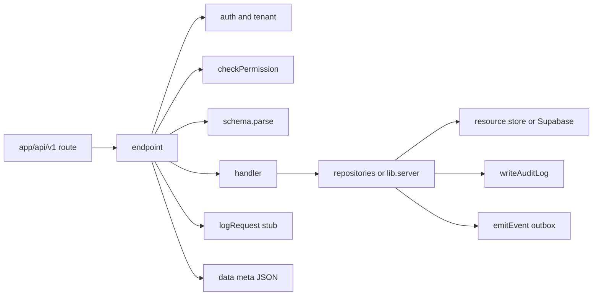

# API Control Plane

Implementation roadmap for a shared `endpoint()` API layer in Splx Studio.
Written so this work can be picked up later without re-deriving context from chat.

**Status:** Phases 1–3 landed. Phases 4–7 outstanding.  
**Canonical repo:** the `deagil/splx` working tree.

> **Implementation notes (Phases 1–3).** Three things changed relative to the plan
> below; see [Deviations from this plan](#deviations-from-this-plan) at the end for
> the reasoning.
>
> 1. Permissions use **`resource.action`** dot notation, not `resource:action:scope`.
> 2. `/api/data/[tableName]` had a **live SQL injection**, not just "thin validation".
>    It is fixed, not deferred.
> 3. The `role_permissions` **table is the runtime source of truth**, with the static
>    map as a fallback — rather than the two diverging permanently.

Related docs: [RBAC_SYSTEM.md](./RBAC_SYSTEM.md), [DATABASE_ARCHITECTURE.md](./DATABASE_ARCHITECTURE.md), [PAGES_SYSTEM.md](./PAGES_SYSTEM.md), [AI_CHAT_SYSTEM.md](./AI_CHAT_SYSTEM.md).

---

## Why this exists

### Product vision (context)

Splx is intended to grow from “data + page builder + AI chat” into an **organizational operating system**:

- Core data (tables) and system definitions (pages, automations, email templates) are first-class editable objects.
- Business processes are Zapier-style automations: typed events → durable step config → deterministic runner.
- UI builder and AI agent use the **same** mutation APIs.
- Definition changes eventually support draft → review → publish (separate from live instance data).

Agent C (`~/Developer/web/agent`, Eve-based) is a strong **agent runtime** (durable sessions, channels, skills, sandbox). Splx is the stronger **kernel** (workspaces, RBAC, tables, pages). Long-term shape: Splx as system of record; Eve-grade agent as a client of Splx APIs — not a merge of the two products. This doc does **not** implement Eve; it builds the control plane both UI and future agent tools need.

### Immediate problem

Today’s API layer cannot safely support that vision:


| Concern          | Today                                                                                                                                   |
| ---------------- | --------------------------------------------------------------------------------------------------------------------------------------- |
| Auth session     | Mostly centralized in `proxy.ts` (Supabase cookies, workspace hint)                                                                     |
| Authorization    | Fragmented — some routes use `resolveTenantContext` + `requireCapability`; workspace admin / chat / helpers use other patterns          |
| Shared wrapper   | **None** — no `withAuth` / `endpoint`; copy-paste `handleError`                                                                         |
| Row mutations    | `/api/data/[tableName]` — raw SQL on resource store, thin validation, **bypasses RLS**                                                  |
| Post-write hooks | **None** — no domain events, no audit trail                                                                                             |
| Request logging  | Ad-hoc `console.*` + generic OTel (`instrumentation.ts` service name `"ai-chatbot"`)                                                    |
| Docs vs code     | `RBAC_SYSTEM.md` describes DB `role_permissions` as SoR; API handlers mostly use a **static** map in `lib/server/tenant/permissions.ts` |


Without a single mutation funnel (auth → permission → validate → write → audit → emit), automations and “agent = same API as UI” cannot be added cleanly.

---


## Target architecture

```text
HTTP → app/api/v1/.../route.ts
     → endpoint({ auth, permission, schema?, handler })
          auth → tenant/roles → checkPermission → Zod body
     → handler({ user, workspace, params, body, requestId, req })
          → repo.* / lib/server/* helpers / getResourceStore()
          → writeAuditLog + emitEvent (on mutations)
     → { data, meta? } → Response.json
     → logRequest stub (requestId, method, path, user, status, duration)
```




### Mental model

Treat routes as **thin adapters**: declare auth + permission + schema; keep handlers focused on orchestration. Prefer repos / `lib/server` for shared mutations. Emit technical events from the base data repo; emit domain events (`order.cancelled`, …) from handlers/lib when the product meaning is known. Always scope by `workspace_id` (or tenant resource store) outside the base repo.

---


## Decisions (locked)


| Decision           | Choice                                                                                                                                                |
| ------------------ | ----------------------------------------------------------------------------------------------------------------------------------------------------- |
| Wrapper            | `endpoint({ auth, permission, schema?, handler })` — same shape as the CodeBase-style internal API pattern                                            |
| Do not port        | Creator-staff / mentorship role loaders and other domain-specific wrapper branches from that other project                                            |
| Layout             | New `server/` tree for control plane; call into existing `lib/server/**` initially (no big-bang move of pages/tables)                                 |
| Permissions        | ~~Declarative `resource:action:scope` strings~~ → **superseded**: dot notation `resource.action`, matching `role_permissions` and the RLS helpers. See [Deviations](#deviations-from-this-plan). |
| Response shape     | `{ data, meta? }`; shared `unauthorized` / `forbidden` / `handleError`; map `Unauthorized` → **401** (today many routes map it to 500)                |
| Repos              | Hybrid: domain repos for pages / tables / reports; `createDataRepository` (or equivalent) for dynamic row CRUD with audit + technical events built in |
| Events             | `emitEvent()` → `event_outbox`; failures **log, do not throw**                                                                                        |
| Event kinds        | System: `db.<table>.created | updated | deleted`; Product: named later (`signup.accepted`, …)                                                         |
| Audit              | `writeAuditLog()` → `audit_logs` on mutations                                                                                                         |
| Request logging    | Stub `console.log` with structured fields + `requestId` until a real sink exists                                                                      |
| Streaming          | Chat / SSE **out of** success-JSON `endpoint`; auth+permission only or a later `streamEndpoint`                                                       |
| Versioning         | New routes under `/api/v1/`; migrate callers; old routes re-export or deprecate                                                                       |
| Resource SQL / RLS | `/api/data` still uses privileged resource-store SQL. Controls are capability + column validation + parameterised statements + audit. **The SQL injection this understated was fixed, not deferred** — see [Deviations](#deviations-from-this-plan). |


---


## Proposed file tree

As built (Phases 1–3). `✅` exists, `⬜` still to come.

```text
server/
  api/
    endpoint.ts          ✅ wrapper
    auth.ts              ✅ resolveTenantContext → EndpointUser adapter
    responses.ts         ✅ unauthorized, forbidden, handleError, success, ApiError
    responses.test.ts    ✅
    types.ts             ✅ EndpointUser / EndpointContext / EndpointConfig
  permissions/
    definitions.ts       ✅ Permission union, aliases, DEFAULT_ROLE_PERMISSIONS
    match.ts             ✅ pure wildcard matcher (no next/headers dependency)
    match.test.ts        ✅
    check.ts             ✅ DB-backed checkPermission, static fallback
  repositories/
    data.ts              ✅ row CRUD + column validation + audit + db.* events
    data.test.ts         ✅ injection, tenant predicate, pagination
    index.ts             ⬜ unified `repo` export — not needed with one repository
    pages.ts             ⬜
    tables.ts            ⬜
    reports.ts           ⬜
  lib/
    audit.ts             ✅ writeAuditLog → audit_logs
    events.ts            ✅ emitEvent → event_outbox
    event-descriptions.ts ⬜ nothing renders these yet

supabase/migrations/
  20260805120000_audit_logs_and_event_outbox.sql   ✅

app/api/v1/
  data/[tableName]/route.ts    ✅
  pages/...                    ⬜
  tables/...                   ⬜
  reports/...                  ⬜
  workspace/...                ⬜

vitest.config.ts               ✅ scoped to server/**/*.test.ts
```

`server/repositories/index.ts` was skipped deliberately: a `repo` barrel export that
re-exports a single repository adds indirection without value. Add it when there are
three or more.

**Keep using (do not delete):**

- `lib/server/tenant/context.ts` — tenant resolution
- `lib/server/tenant/resource-store.ts` — local vs hosted DB
- `lib/server/pages`, `lib/server/tables`, `lib/server/reports`, `lib/server/data`
- `proxy.ts` — session cookie refresh + workspace header (middleware stays; wrapper re-checks)

**Replace over time:**

- Direct `requireCapability` / static `"pages.edit"` strings in route handlers → declarative permissions on `endpoint`
- Per-route `handleError` copies → `server/api/responses.ts`

---


## Permissions sketch

Start by mapping today’s static capabilities (`[lib/server/tenant/permissions.ts](../lib/server/tenant/permissions.ts)`) into declarative form. Fix known bugs while doing so:


| Bug                                                    | Status | Fix                                                                 |
| ------------------------------------------------------ | ------ | ------------------------------------------------------------------- |
| Routes require `data.read` but map has `data.view`     | ✅ done | `data.read` canonicalised to `data.view` in `definitions.ts`         |
| `workspace.manage` used but not in map                 | ✅ done | Seeded for admin in the Phase 2 migration                            |
| `/api/tables` GET gated on `pages.view`                | ✅ done | Now `tables.view`                                                    |
| No `resource.*` wildcard expansion in TS               | ✅ done | `server/permissions/match.ts`, matching `user_has_access()` in SQL   |
| Static map missing every `reports.*` / `chat.*` grant  | ✅ done | Static map is now derived from `DEFAULT_ROLE_PERMISSIONS`            |
| Workspace users/roles/invites lack RBAC                | ⬜ open | Phase 5 — `/api/workspace/users` still has a `TODO` and no check     |


Example role mapping (initial):


| Role    | Permissions (illustrative)                                   |
| ------- | ------------------------------------------------------------ |
| admin   | `*`                                                          |
| builder | pages/tables/reports edit+view; data view/create/edit/delete |
| user    | pages/tables view; data view/create/edit/delete              |
| viewer  | pages/tables/data view only                                  |


Expand later: `automations:edit:workspace`, `automations:publish:workspace`, `templates:edit:workspace`.

**Note:** the reconciliation this section anticipated was done up front rather than
deferred. `role_permissions` is the runtime source of truth for API-handler
authorization: `server/permissions/check.ts` reads it (cached 60s) and falls back to
`DEFAULT_ROLE_PERMISSIONS` only when the table is unreachable. RLS continues to guard
Supabase-client paths using the same rows and the same wildcard semantics.

Remaining divergence risk: the static fallback map in `definitions.ts` must be kept in
step with the migration's seed by hand. If you add a permission, add it in both.

---


## Example route (target)

The shipped version (`app/api/v1/data/[tableName]/route.ts`):

```ts
import { z } from "zod";
import { endpoint } from "@/server/api/endpoint";
import { ApiError } from "@/server/api/responses";
import { dataRepository } from "@/server/repositories/data";

// The envelope only — a JSON object, not an array or scalar. Keys are validated
// against the table's real columns inside the repository, which is the only
// place that knows them.
const rowSchema = z.record(z.string(), z.unknown());

export const PATCH = endpoint<Record<string, unknown>, { tableName: string }>({
  auth: "required",
  permission: "data.edit",
  schema: rowSchema,
  async handler({ user, params, body, query, requestId }) {
    const recordId = query.get("id");
    if (!recordId) {
      throw new ApiError(400, "Record ID is required");
    }

    const repo = dataRepository({ tenant: user.tenant, requestId });
    const record = await repo.update(params.tableName, recordId, body);
    if (!record) {
      throw new ApiError(404, "Record not found");
    }

    // repo.update: parameterised SQL → writeAuditLog → emitEvent('db.<table>.updated')
    return { data: { record } };
  },
});
```

Handlers stay orchestration-only. Audit and technical events live in the repository so
that non-HTTP callers — AI tools, a future automation runner — get them too.

---


## Current capability inventory (baseline)

Use this when migrating; do not assume README claims over code.


| Area                            | Status  | Notes                                                         |
| ------------------------------- | ------- | ------------------------------------------------------------- |
| Workspaces / RBAC roles         | Exists  | admin/builder/user/viewer; nav polish incomplete              |
| Dynamic tables + `/api/data`    | Exists  | Mutate path is the priority for v1                            |
| Pages / blocks                  | Exists  | Trigger **execute** is a stub (`useTriggerBlockAction` no-op) |
| Reports                         | Exists  |                                                               |
| Documents / chat artifacts      | Exists  | Chat side-products, not system definitions                    |
| AI tools write path             | Partial | Documents only; no page/table/automation mutations            |
| Events / webhooks / automations | Missing | Workflows nav “Coming soon”                                   |
| Email templates as entities     | Missing | Only product release emails                                   |
| Draft → publish for definitions | Missing | Page “draft” = in-memory; autosave writes live                |
| Central audit / request log     | Missing |                                                               |


---


## Implementation phases


### Phase 0 — Doc + agreement (this document)

No code. Align on decisions above.

### Phase 1 — Foundation ✅ done

1. ✅ `server/api/{endpoint,auth,responses,types}.ts`.
2. ✅ `server/permissions/{definitions,check,match}.ts`. `data.read` is canonicalised
   to `data.view`; `workspace.manage` is seeded for admin.
3. ✅ Adapter: `resolveTenantContext` → `EndpointUser` (`server/api/auth.ts`).
4. ✅ Unit tests for permission matching and error mapping (Vitest, `pnpm test:unit`).

**Exit met:** `/api/v1/data/[tableName]` proves the wrapper (a throwaway health route
was unnecessary).

Also fixed in this phase:

- `lib/server/tenant/permissions.ts` now shares the same definitions and wildcard
  matcher, so the 17 routes still on `requireCapability` get the corrected grants too.
- `/api/tables` GET gated on `pages.view`; now `tables.view`.
- `proxy.ts` returns JSON 401 for unauthenticated `/api/*` instead of a 307 to the
  HTML signin page, and no longer fires the onboarding redirect at API paths
  (closes risk #3 below).
- Local-mode privilege escalation in `resolveTenantContext` — see
  [Deviations](#deviations-from-this-plan).

### Phase 2 — Audit + event outbox tables ✅ done

1. ✅ `supabase/migrations/20260805120000_audit_logs_and_event_outbox.sql`.
2. ✅ `server/lib/audit.ts`, `server/lib/events.ts` — both catch-and-log.
3. ⬜ `event-descriptions.ts` — skipped; nothing renders these yet.

Both tables are mirrored in `lib/db/schema.ts`. RLS is on with select-only policies
for workspace members; writes go through the privileged connection only.

### Phase 3 — Data API v1 ✅ done

1. ✅ `server/repositories/data.ts` — table config load, column validation,
   parameterised INSERT/UPDATE/DELETE, `writeAuditLog` + `emitEvent`.
2. ✅ `app/api/v1/data/[tableName]/route.ts`.
3. ✅ Legacy `/api/data/[tableName]` is a thin delegator that flattens the
   `{ data, meta }` envelope back to the old shape. It exists because the page-block
   generator writes `/api/data/${tableConfig.id}` into saved page configs, so those
   URLs are persisted in the `pages` table and cannot be changed by editing code
   alone. Delete it once saved configs are migrated.
4. ✅ Path contract documented: the segment is the table **config id**; the physical
   name is resolved from config and verified against `information_schema`.

**Note on validation:** bodies are validated against the table's **real columns**, not
`config.field_metadata`. The latter is `.optional().default([])`
(`lib/server/tables/schema.ts:71`), so validating against it would reject every write
to a table that has no metadata — which is most of them.

### Phase 4 — Pages / tables / reports mutations

1. Wrap save/create/delete routes under `/api/v1/...` with `endpoint`.
2. Call existing `lib/server/pages|tables|reports`; add audit (+ events where useful).
3. Keep Zod where it already exists (pages); add where missing.

**Exit:** Builder mutations use declarative permissions + consistent JSON errors.

### Phase 5 — Workspace admin routes

1. Migrate `/api/workspace/users|roles|invites` to `endpoint` with real manage permissions (close TODOs that allow any member to mutate).
2. Align with Builder vs Admin product rules.

**Exit:** No privileged workspace mutation without declared permission.

### Phase 6 — Automations-ready (emit side only)

Do **not** build the full runner yet. Ensure:

1. Document how a future runner drains `event_outbox` (or listens to inserts).
2. Optional: emit a first **domain** event from a known mutation (e.g. after row create when table is tagged) — only if a concrete use case exists.
3. Wire Trigger block execute to an **action** helper that goes through the same permissioned path (replace stub) — even a single “HTTP webhook” or “update row” action proves the pattern.

**Exit:** Events exist in the DB; trigger button does one real action.

### Phase 7 — Agent alignment (later)

1. Splx AI tools that mutate system objects must call the same repos or `/api/v1` (not a parallel write path).
2. Optional: replace `ToolLoopAgent` with Eve as runtime — **out of scope** for Phases 1–6; requires auth adapter (Supabase session → Eve) and streaming design.

---


## Out of scope (for this roadmap’s coding phases)

- Full automation builder UI + workflow runner product
- Email/notification templates as first-class entities (track as follow-on once events exist)
- Draft → review → publish / config diff PR UX
- Replacing Splx chat with Agent C / Eve
- Porting creator/mentorship permission machinery from the other codebase
- Exposing raw Postgres functions/triggers as editable UI (model as actions + events first)

---


## Org-OS follow-ons (after control plane)

Ordered for when someone picks up the larger vision:

1. Action catalog (update row, HTTP, send email by template id)
2. Event catalog (typed names + payloads)
3. Emit from data repo / triggers / inbound webhook
4. Automations CRUD (durable JSON/graph)
5. Runner consuming outbox / webhooks
6. Email templates as entities + visual editor
7. Draft/publish for automations (+ run history, dry-run)
8. Agent tools → same automation/template APIs

The control plane (this doc) is the prerequisite for steps 3–8.

---


## Risks and invariants

1. **RLS bypass on** `/api/data` remains until deliberately redesigned; do not claim
   “RLS protects all API writes.” Writes are now parameterised, column-validated, and
   audited, and scoped by `workspace_id` where that column exists — but they still run
   on a privileged connection that RLS does not constrain.
2. ~~**Dual permission sources**~~ → **partly resolved.** `role_permissions` is the
   runtime source of truth for the control plane (`server/permissions/check.ts` reads
   it, cached 60s, static map as fallback), and the legacy synchronous
   `requireCapability` now shares the same definitions and matcher. What remains: the
   static map must be kept in sync with the migration's seed by hand, and
   `role_permissions` is global while `roles` is workspace-scoped.
3. ~~**Middleware redirects** unauthenticated `/api/*` to HTML signin~~ → **fixed.**
   `proxy.ts` returns JSON 401 for API paths and skips the onboarding redirect there.
4. **Chat streaming** must not be forced into `{ data, meta }` responses. Still true —
   `endpoint()` is for JSON routes only; the chat route is untouched.
5. **Agent must not bypass** the control plane when writing system objects — otherwise
   audit/events lie. Still true: `lib/ai/tools/query-user-table.ts` reads through
   `lib/server/data/query`, and no AI tool writes rows yet. Any tool that gains a write
   path must go through `server/repositories/data.ts`.
6. **Local mode is not a security boundary.** The default-workspace bootstrap grants
   admin to whoever signs in first, and physical user tables have no `workspace_id`
   column to scope by.

---


## Pickup checklist

Phases 1–3:

- [x] Phase 1: `server/api` + permissions (`/api/v1/data` proves the wrapper)
- [x] Phase 2: migration for `audit_logs` + `event_outbox`
- [x] Phase 3: migrate data CRUD (biggest win)
- [x] Update this doc’s **Status** line
- [x] Keep [RBAC_SYSTEM.md](./RBAC_SYSTEM.md) in sync

Picking up Phase 4 onwards:

- [ ] Re-read this doc, its [Deviations](#deviations-from-this-plan) section, and
      [DATABASE_ARCHITECTURE.md](./DATABASE_ARCHITECTURE.md)
- [ ] Run `pnpm test:unit` first — it should be green before you start
- [ ] Phase 4: wrap pages / tables / reports mutations in `endpoint()`
- [ ] Phase 5: workspace admin routes — **start with the `/api/workspace/users` RBAC
      hole**, which is a live bug, not a migration
- [ ] Migrate saved page-block configs off `/api/data/` so the legacy delegator can go
- [ ] Parameterise `lib/server/tables/query-builder.ts`

---


## Deviations from this plan

Three decisions were changed during implementation. Recorded here so the original
"locked" table above is not read as still-current.

### 1. Dot notation, not `resource:action:scope`

The Decisions table locked in `resource:action:scope`. That was not adopted.

The `role_permissions` table (seeded by `20251215200000_resource_permissions.sql`)
uses `resource.action`, and the SQL helpers the 44 RLS policies call —
`user_has_access`, `user_at_least` — parse that format, including `resource.*`
wildcard expansion via `split_part(p_permission, '.', 1)`. Introducing a colon form
in TypeScript would have made SQL, RLS, and the control plane three dialects of the
same idea, with no migration path between them.

`server/permissions/definitions.ts` therefore uses dot notation, and
`server/permissions/match.ts` implements the same wildcard semantics as the SQL
helper. The `:scope` suffix was dropped entirely — every permission today is
workspace-scoped, so it encoded no information.

### 2. `/api/data` had a live SQL injection

The Risks section said RLS bypass on `/api/data` "remains until deliberately
redesigned" and the Decisions table framed the controls as "capability + validation +
audit". The actual state was worse and could not be deferred:

```ts
// old app/api/data/[tableName]/route.ts, POST
else values.push(String(value));            // L175
// ...and PATCH
else updates.push(`${escapedKey} = ${value}`);   // L251
```

Only strings and nulls were escaped. Any non-string, non-null JSON value was
interpolated raw into a `sql.raw()` statement, so a body of
`{"qty": ["1); DROP TABLE contacts; --"]}` was injected verbatim — executing as the
privileged `POSTGRES_URL` role, reachable by any member with `data.create` (which
includes the `user` role).

Two related defects were fixed at the same time:

- **Arbitrary column writes.** The table config was fetched purely as a 404 gate and
  its columns were never consulted, so a caller could write `workspace_id`, `id`, or
  any column the UI never exposed.
- **No tenant predicate on writes.** `PATCH`/`DELETE` emitted `WHERE <pk> = <id>` with
  nothing else. In local mode every workspace shares one physical database, so a
  member of workspace A could update or delete workspace B's rows by id.

`server/repositories/data.ts` binds every value as a parameter and interpolates
identifiers only after matching them against `information_schema.columns`.

### 3. Tenant scoping is opportunistic, and local mode is not a security boundary

The plan assumed a workspace predicate could simply be added. It cannot be added
universally: **user tables created through Splx have no `workspace_id` column**
(`lib/server/tables/postgres/create-table.ts` does not add one). Only the `tables`
config registry is workspace-scoped.

So the repository adds `AND workspace_id = $ws` **only when the physical table
actually has that column** — free, since it introspects columns anyway. Where the
column does not exist, the workspace boundary is:

- **hosted mode** — the physical connection, which is genuinely per-workspace;
- **local mode** — the config registry only. Two workspaces that register the same
  table name share rows.

Relatedly, `resolveTenantContext` auto-enrolled any authenticated caller as **admin**
of whatever workspace `x-workspace-id` named — and `proxy.ts` forwards that request
header verbatim from the client. That let any authenticated user become admin of any
workspace by guessing its UUID. Auto-enrolment is now restricted to the configured
bootstrap workspace; any other requested workspace requires existing membership.

The default-workspace bootstrap in local mode still grants admin to whoever signs in
first, because that is what makes `pnpm dev` work on a fresh checkout. **Do not run
`APP_MODE=local` anywhere that treats its workspaces as a security boundary.**

### Not addressed

Found during this work, deliberately left for a follow-up:

- `/api/workspace/users` `PATCH`/`DELETE` carry a `// TODO: Add proper RBAC check` and
  perform none — any member can change another member's role or remove them. This is
  Phase 5, but it is a live privilege-escalation bug, not a cleanup item.
- Unauthenticated routes: `/api/ai/generate-table-fields` (anyone reaching it can burn
  LLM tokens), `/api/og-metadata` and `/api/url-content` (both fetch caller-supplied
  URLs — SSRF surface).
- `lib/server/tables/query-builder.ts` still builds `WHERE` clauses by string
  concatenation with the same `typeof v === "string" ? escapeString(v) : String(v)`
  pattern. The v1 read path is safe because filter keys are validated against real
  columns and filter values arrive from `URLSearchParams` as strings, but the helper
  itself should be parameterised.
- `resolveTenantContext` opens and closes a fresh `postgres()` pool on every call; a
  single API request opens three or more counting middleware.
- `role_permissions` is global while `roles` is workspace-scoped (composite PK
  `workspace_id, id`), so a workspace defining a custom role gets no permissions and
  is denied everything.
- `pnpm lint` is broken independently of this work: `biome.jsonc` has
  `extends: ["ultracite"]`, but ultracite 6 exports `ultracite/core`, `ultracite/next`,
  … so the config does not resolve. It fails on a clean tree.

---

## Reference: pattern source

Internal APIs on a sibling CodeBase-style project use thin Next route handlers wrapped by `endpoint()` (`server/api/endpoint.ts`), hybrid repos + direct Supabase, centralized `emitEvent` / `writeAuditLog`, and a stub `logRequest`. Splx should adopt that **shape** without its domain-specific role-loading branches inside the wrapper.